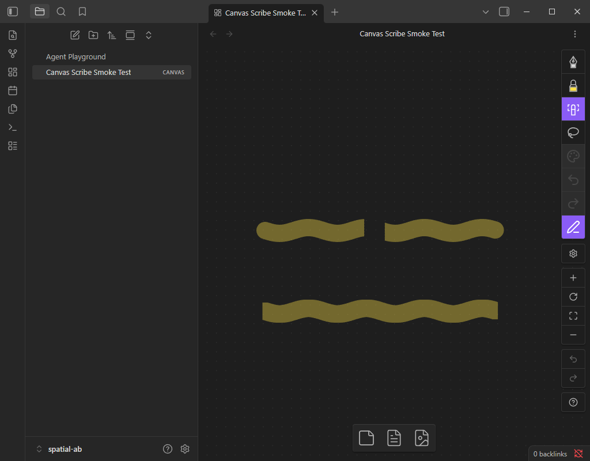

# Spatial lookup in real Obsidian — FER-91

## Outcome

Both spatial indexes substantially reduce scanning work in the actual Canvas
eraser. Neither resolves the long-highlighter area-cut pause. RBush and Grid 256
are close in whole-stroke erasing on this fixture; these runs do not establish a
universal speed winner. The earlier Node experiment still provides the index
memory comparison; memory was not remeasured here.

Median cumulative CPU time in Canvas's eraser handler over one 13-point pen gesture,
including synchronous SVG updates, with **10,000 strokes**:

| Gesture | Current scan | RBush | Grid 256 |
| --- | ---: | ---: | ---: |
| Empty space | 54.8 ms | 0.9 ms | 0.8 ms |
| Erase a whole round highlighter | 69.3 ms | 19.7 ms | 19.2 ms |
| Area-cut a round highlighter | 540.4 ms | 499.5 ms | 475.4 ms |

These totals span the gesture, not a single frame. For area erasing, the median
slowest handler was still **215.3 / 199.4 / 193.1 ms**, respectively. The first
geometry-changing operation alone was **200.3 / 186.1 / 182.0 ms**. This confirms
that narrowing candidates is useful but the target highlighter's clipping work
needs separate attention.

At 3,000 strokes, whole-stroke handler totals were 31.7 / 8.5 / 9.7 ms; area-cut
totals were 436.5 / 412.4 / 409.4 ms. See the [full table](spatial-sandbox/report.md)
and [raw observations](spatial-sandbox/results.json).

## Conditions and fairness

- Disposable `spatial-ab` vault in the comparison worktree, based on `289fa61`.
- Obsidian 1.12.7, Electron 39.8.3 / Chromium 142, Windows x64, Intel i9-13900K;
  1024 × 800 viewport. Input came through trusted CDP pen events at a requested
  8 ms interval. Canvas interpolated each gesture into 25 erase operations.
- Two visible 1,000-point highlighters (round target and untouched chisel), with
  remaining strokes remote 80-point fountain ink. This tests large documents with
  sparse visible ink, not thousands of overlapping visible strokes.
- Four rounds per case: one labelled warmup, three measured; rotate algorithm
  order. Fresh stroke objects and identical coordinates per run. Three repetitions
  are enough for exploratory medians, not reliable tail-latency claims.
- The same experimental build executes all three algorithms. Only the Canvas
  eraser call is redirected by the explicit build script; precise geometry, input,
  interpolation, history, SVG handling and persistence use the existing plugin.
- Warm runs construct indexes before input and report preparation separately.
  The scan retains its normal lazy bounds behavior. Initial preparation cost must
  be considered alongside warm gesture cost. File seeding, rendering the initial
  fixture and saving/checking results are outside handler timing.
- The indexed adapter includes ordered-array reconciliation, maintaining integer
  order after splitting, and incremental removals/insertions. Its changed-result
  bookkeeping is more conservative than the earlier Node pipeline prototype.
- Instrumented handler timings do not measure compositor presentation or physical
  input latency. No Galaxy/S Pen acceptance or production selection is implied.

## Cold use and undo

Single exploratory 10,000-stroke probes, including lazy index construction:

| Method | Cold first operation | First operation after undo |
| --- | ---: | ---: |
| Current scan | 36.9 ms | 10.0 ms |
| RBush | 30.5 ms | 22.2 ms |
| Grid 256 | 47.3 ms | 37.4 ms |

Both indexes rebuilt exactly once per probe and produced correct geometry after
undo replaced the stroke array. These isolated samples are not a ranking. They
show why production integration should prepare/reconcile the index at document
load or history replacement rather than unexpectedly rebuilding on first input.
[Lifecycle data](spatial-sandbox/lifecycle.json).

## Correctness and persistence

- All 72 comparison gestures passed, including 1,800 operation-by-operation
  comparisons against production `eraseInk`, ignoring only generated fragment IDs.
- All six cold/undo gestures passed another 150 operation comparisons.
- Whole-stroke gestures removed exactly the round target; area cuts produced two
  target fragments. The untouched chisel SVG path retained its DOM identity.
- Every changed comparison gesture passed undo/redo object-identity checks. Every
  run compared complete saved geometry with the live result.
- A final area-cut preview passed 25 further geometry checks. Restored the normal
  production build with `sandbox:prepare`, verified installed build files and
  reloaded. All 10,001 strokes and their complete serialized geometry survived:
  SHA-256 `1c0612dee500e4ec6704925d3876b4e6fc61b741aefbdbf431b22b1c49d9b814`.
  The experiment global was absent after reload. See [before](spatial-sandbox/before-reload.json)
  and [after](spatial-sandbox/after-reload.json).
- `pnpm check` passed: metadata, production build, 286 tests in 42 files. Separate
  benchmark TypeScript validation passed. Three new adapter tests cover repeated
  cuts, ordering, filtered erasing and history/external array replacement.

Experimental installed `main.js` SHA-256 during measurements:
`077dd743829bd64e7042ac950111433e9bd038a7992a0dfff705b15ae68a0133`.
The sandbox now runs the normal build and retains the visible cut shown below.

Reproduction commands and experiment limitations are in
[the comparison guide](../spatial-comparison.md#real-obsidian-sandbox-experiment).
